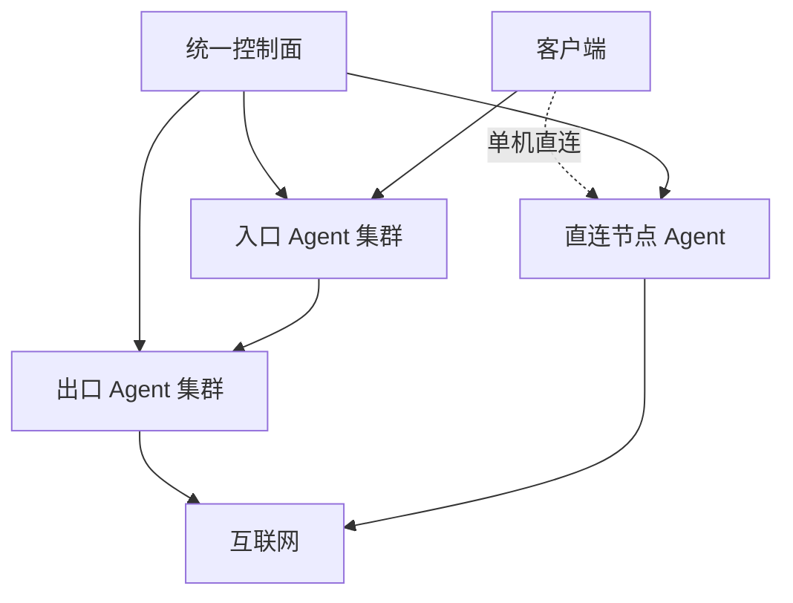

# NexusGate（枢门）

面向多入口机、多出口机和多客户场景的轻量集中编排面板。一个控制面统一管理设备、客户额度、转发线路、单机节点、部署任务和客户端链接，不再逐台打开不同面板维护。

> 当前版本：`v0.2.1`。已能下发真实 Xray 配置，适合先在测试设备验证；正式迁移前仍需验证客户端兼容性、云安全组和系统防火墙。

## 核心模型

NexusGate 把管理面与流量面分开。客户流量不会经过控制面，控制面只负责把期望配置下发给各设备 Agent。



- **转发线路**：一台或多台入口设备 → 一台出口设备；客户端协议与入口到出口传输协议可以不同。
- **单机直连**：无需出口设备，直接在选定设备创建客户端节点。
- **Agent 主动连接**：控制面不保存各设备的 SSH 密码。
- **一条线路统一维护**：编辑、修复、停用、重建不再分别操作每台服务器。

## 当前已实现

- 默认明亮、可切换暗色的中文响应式 UI；登录页仅保留账号与密码，不显示业务介绍。
- 固定宽度侧栏与可阅读的横排导航：“概览、服务器、客户、线路、部署与链接、设置与运维”。
- 设备、客户、线路均可创建后编辑；运行中线路修改后进入“待重新部署”。
- 线路表单中的入口设备和客户可搜索后多选，长列表在固定高度内滚动。
- 支持完整重建失败线路，以及只重试失败部署项。
- Agent 重装后自动撤销旧密钥、重新对账并恢复已有资源。
- 任务 5 分钟租约、超时自动重试，连续 3 次失败才标记异常。
- 客户到期使用日期选择器、常用期限下拉和时间下拉，不要求手写日期格式。
- 客户独立凭据、流量额度、到期、滚动 IP 上限、用量清零及启停。
- Reality 私钥只在节点机生成；控制面只接收客户端公钥。
- Tesla、Amazon、Apple、Intel、AMD Reality 目标预设，也可自定义。
- IPv4、IPv6 和双栈监听；IPv6 客户端链接会自动使用方括号格式。
- JSON 在线备份/恢复，以及包含数据、环境和 Caddy 配置的迁移压缩包。
- 后台修改登录账号和密码；修改后强制重新登录。
- `ng` 运维菜单：升级、域名、证书、备份、恢复、管理员账号/密码、状态、日志、重启和卸载。
- 失败/未完成线路可从“线路”删除；尚未确认清理的节点资源保留隐藏记录与任务，设备重新上线后继续清理，避免遗留监听端口。
- 若离线设备永久损坏，可在删除关联线路后使用“强制遗忘”；这会放弃远程清理，因此仅限设备已销毁或已手工清除代理配置时使用。
- 线路删除后客户可立即删除；后台仍保留设备资源清理任务。设备登记需要等 Agent 清理确认，或在目标机卸载后对离线设备选择遗忘。
- 每客户独立随机订阅地址，支持 Base64、原始 URI、Mihomo/Clash YAML、sing-box JSON；可重置地址。只分发已成功部署的节点，停用/到期/流量用尽时拒绝分发。
- 入口/出口 Agent 可以在目标机通过 `ng-agent uninstall` 卸载专属服务、配置和密钥；控制台删除登记会撤销其访问资格。
- Agent 支持 Debian/Ubuntu、RHEL 系 systemd，以及 Alpine OpenRC。

## 协议矩阵

| 用途 | 协议 | 状态 |
| --- | --- | --- |
| 客户入口 / 单机节点 | VLESS + Reality + Vision | 可部署 |
| 客户入口 / 单机节点 | VLESS + Reality | 可部署 |
| 客户入口 / 单机节点 | VLESS + WebSocket（无 TLS） | 可部署，建议仅配合可信网络或外层 TLS |
| 客户入口 / 单机节点 | VMess + WebSocket（无 TLS） | 可部署，兼容模式 |
| 客户入口 / 单机节点 | Shadowsocks 2022 AES-128 / AES-256 | 可部署 |
| 客户入口 / 单机节点 | Shadowsocks AES-128-GCM / AES-256-GCM | 可部署 |
| 客户入口 / 单机节点 | SOCKS5 用户密码 | 可部署，仅建议可信网络或外层隧道 |
| 入口 → 出口 | 上述四种 Shadowsocks | 可部署 |
| 入口 → 出口 | VLESS TCP | 可部署，建议可信网络或外层隧道 |
| 入口 → 出口 | SOCKS5 用户密码 | 可部署，仅建议可信网络或外层隧道 |
| 客户入口 | VLESS WS TLS / Hysteria2 / AnyTLS | 规划中；当前不提供可部署选项 |

Hysteria2 和 AnyTLS 需要 sing-box/QUIC/TLS 证书管理链路，VLESS WS TLS 也需要节点域名与证书自动化。项目不会把未完成的适配器伪装成可用功能。

Reality 默认目标/SNI 为 `www.tesla.com:443`，也可选 Amazon、Apple、Intel、AMD 或自定义。目标必须实际接受所选 SNI，预设本身不是防共享或防盗用手段；访问控制依赖每客户随机 UUID、shortId 等凭据。

> “设备数量”无法通过一个共享客户端链接可靠识别。当前保存设备策略上限，但暂不强制；后续需要“一设备一凭据”签发。当前执行的是流量、到期和滚动 IP 上限，统计与停用存在 Agent 上报间隔。订阅令牌重置只阻止再下载；已导入的节点凭据须停用或重建线路后才能撤销。

## 安装控制面

准备一台 Debian 12 或 Ubuntu 22.04/24.04 VPS，把面板域名的 A/AAAA 记录解析到它，并放行 TCP 80、443：

```bash
bash <(curl -fsSL https://raw.githubusercontent.com/a2899882/NexusGate/main/scripts/install.sh)
```

非交互安装：

```bash
bash <(curl -fsSL https://raw.githubusercontent.com/a2899882/NexusGate/main/scripts/install.sh) \
  --domain gate.example.com --email admin@example.com
```

安装器会部署 Node.js、Caddy、systemd 服务，启用自动 HTTPS，并输出首次登录密码。

登录后的顺序：

1. 在“服务器”添加入口、出口或综合节点。
2. 点击“注册 / 重装”，复制一次性命令到目标 VPS 以 root 执行。
3. 在“客户”创建客户。
4. 在“线路”选择转发线路或单机直连，选择协议、设备、客户和端口策略。
5. 点击部署，在“部署与链接”复制单条客户端链接，或在“客户 → 订阅链接”获取自动识别、Base64、Clash/Mihomo、sing-box JSON 和原始 URI 地址。

订阅 URL 属于凭据；请经 HTTPS 私下交付。自动识别格式根据客户端 User-Agent 返回 Clash/Mihomo 或 Base64；客户端识别不准时使用对应的固定格式。sing-box JSON 是可直接导入的本机 127.0.0.1:2080 混合入站配置，可能与已有监听端口冲突。自定义模板、Surge 格式和二维码仍待开发。

> 云安全组和系统防火墙必须放行实际使用的 TCP/UDP 端口。默认端口池为 `20000–50000`，生产环境建议按设备缩小范围。

### Alpine Agent

Alpine 首次执行前如果没有 Bash：

```sh
apk add --no-cache bash curl
```

然后运行面板生成的同一条注册命令。安装器会自动使用 OpenRC。

## 升级

控制面一键升级会先自动备份，再下载 GitHub `main` 分支并执行健康检查：

```bash
ng update
```

旧版 Agent 可保留当前注册密钥原地升级：

```bash
curl -fsSL https://raw.githubusercontent.com/a2899882/NexusGate/main/scripts/agent-update.sh | bash
```

新安装的 Agent 以后直接运行：

```bash
ng-agent-update
ng-agent uninstall         # 新版 Agent 在目标机交互卸载
```

如果某台设备已出现“上线后又离线”，在控制面为该设备重新生成一次“注册 / 重装”命令并执行。v0.2 安装器会显式重启旧进程，并自动恢复控制面记录的资源。

老 Agent 没有 `ng-agent` 命令时，先运行 `ng-agent-update`，或在目标机运行：

```bash
curl -fsSL https://raw.githubusercontent.com/a2899882/NexusGate/main/scripts/agent-uninstall.sh | bash
```

卸载仅删除 NexusGate 专属的 Agent/Xray 服务、`/etc/nexusgate` 配置与密钥、Agent 程序和日志。共用的 Node.js 和 `/usr/local/bin/xray` 不会被自动删除。卸载后回控制台删除设备；如果之前的清理任务尚未确认且设备已离线，用“遗忘离线设备”撤销登记。控制台遗忘不能远程删除旧机器资源。

## `ng` 管理菜单

```bash
ng                         # 交互菜单
ng update                  # 备份、升级、健康检查
ng domain new.example.com  # 更换面板域名
ng cert                    # 校验 Caddy 并检查证书日志
ng backup                  # 生成 /root/nexusgate-backup-*.tar.gz
ng restore /root/文件.tar.gz
ng account                 # 交互修改当前管理员账号和/或密码
ng account oldname         # 指定旧账号；ng password 为兼容别名
ng status
ng restart
ng logs 200
ng uninstall               # 确认后先备份再卸载
```

Caddy 会自动申请和续签证书，不需要定时手工续签；`ng cert` 用于校验配置、重新加载并查看最近证书日志。

## 容灾迁移

NexusGate v0.2 是单控制面、冷备恢复模型，不支持两台控制面同时写同一个 JSON 数据库。

1. 提前降低面板域名 DNS TTL。
2. 在旧控制面执行 `ng backup`，下载 `/root/nexusgate-backup-*.tar.gz`。
3. 在新 Debian/Ubuntu 服务器安装 NexusGate，使用原面板域名。
4. 把压缩包上传到新服务器 `/root`，执行 `ng restore /root/文件名.tar.gz`。
5. 把 Cloudflare/DNS 的 A/AAAA 记录改为新服务器 IP，并确保 80/443 放行。
6. Caddy 获取证书后，各 Agent 仍连接同一域名，会自动恢复上报；无需逐台更改控制面地址。

迁移包包含：控制面数据库、登录/运行环境配置和 Caddy 站点配置。恢复前系统还会在 `/root` 自动再生成一份安全快照。

## 配置建议

控制面不承载客户流量，主要消耗来自 Agent 心跳、任务和统计写入。

| 规模 | 建议控制面配置 | 说明 |
| --- | --- | --- |
| 测试 / 20 台以内 | 1 vCPU / 1 GB / 20 GB SSD | 可运行，不建议承担关键业务 |
| 20–100 台、数百客户 | 2 vCPU / 2–4 GB / 40 GB NVMe | 推荐生产起点 |
| 100–300 台、约千名客户 | 4 vCPU / 8 GB / 80 GB NVMe | 需要监控磁盘延迟并缩短日志保留 |
| 更大规模或多管理员高频操作 | PostgreSQL/队列版 | 当前 JSON 单机版不建议继续横向放大 |

Agent 节点推荐至少 `1 vCPU / 512 MB`，更稳妥为 `1 vCPU / 1 GB`。节点能承载多少用户主要取决于带宽、连接数、加密协议和线路质量，而不是控制面配置。

## 轻量与安全设计

- 控制面和 Agent 均无 npm 运行依赖，只要求 Node.js 18+。
- Agent API Key 使用指纹快速定位，再用 scrypt 校验，避免大量心跳反复全表执行慢哈希。
- 数据文件、备份和 Agent 环境文件默认权限为 `0600`。
- 登录 Cookie 为 HttpOnly、SameSite=Strict，HTTPS 下启用 Secure；写操作需要 CSRF Token。
- Xray 配置先执行 `run -test`，通过后才原子切换；失败会回滚资源文件。
- Agent 重启会从持久化资源目录重建完整 Xray 配置。
- 仅在你有权管理的服务器和网络上使用，并遵守所在地法律和服务商政策。

更完整的说明见 [架构](docs/ARCHITECTURE.md)、[安全模型](docs/SECURITY.md) 和 [路线图](docs/ROADMAP.md)。

## 本地开发

```bash
export NG_ADMIN_PASSWORD='change-this-password'
export NG_COOKIE_SECURE=false
npm test
npm start
```

打开 <http://127.0.0.1:8787>，默认账号为 `admin`。

## 许可

[MIT](LICENSE)。NexusGate 不打包或重新许可 Xray-core；Agent 安装器从 Xray 官方 Release 下载独立二进制。
