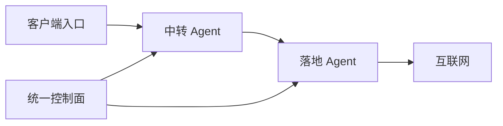

# NexusGate（枢门）

面向多中转机、多落地机和团队客户的轻量集中编排面板。一个控制面统一管理服务器、客户额度和跨机链路，不再为每台机器分别安装、打开和维护一套面板。

> 当前版本：`v0.1.0` 技术预览。可安装、可管理、可下发真实 Xray 配置，但在生产迁移前应先用测试服务器验证协议兼容性和防火墙规则。

## 为什么做这个项目

传统单机面板擅长管理一台 VPS，但在「10 台中转 + 数十台落地 + 数百客户」的场景中，会出现面板入口分散、凭据分散、批量变更困难，以及中转与落地协议被错误绑定的问题。

NexusGate 把它们拆成三个层次：



- 控制面：客户、额度、到期、链路模板、任务和审计。
- Agent：主动出站连接控制面，不要求控制面保存 SSH 密码。
- Xray-core：运行数据面；Agent 先校验完整配置，再原子切换。

项目参考了 [3X-UI](https://github.com/MHSanaei/3x-ui) 的易用性和 Xray 管理经验，但代码为独立实现，不复制其源代码。Xray-core 由 [XTLS/Xray-core](https://github.com/XTLS/Xray-core) 单独提供并遵循其 MPL-2.0 许可。

## 已实现

- 多中转、多落地服务器集中登记、地区/标签与端口池。
- 一次选择多台中转、一台落地和多个客户进行批量编排。
- 中转入口与落地传输解耦，例如：
  - `VLESS + Reality + Vision → Shadowsocks 2022 AES-128`
  - `Shadowsocks 2022 AES-128 → Shadowsocks 2022 AES-128`
  - `VMess + WebSocket → Shadowsocks AES-128-GCM / 2022`
- 每位客户独立凭据、流量额度、到期时间和并发 IP 策略。
- Xray Stats 流量采集；超额或到期后自动下发移除任务。
- 基于访问日志的滚动 IP 观察与超限停用（默认 10 分钟窗口）。
- Reality 私钥只在目标服务器生成和保存，控制面接收客户端公钥。
- 任务队列、错误状态、审计记录与自动清理。
- 响应式中文 UI；登录页使用中性措辞。
- JSON 在线备份/恢复，以及 `ng` 命令生成压缩迁移包。
- Debian 12 / Ubuntu 一键安装、Caddy 自动 HTTPS 与域名反代。
- 无 npm 运行依赖；控制面和 Agent 都只需要 Node.js 18+。

## 协议状态

| 场景 | 协议 | 状态 |
| --- | --- | --- |
| 客户 → 中转 | VLESS + Reality + Vision | 稳定配置适配器 |
| 客户 → 中转 | Shadowsocks 2022 AES-128 | 稳定配置适配器 |
| 客户 → 中转 | VMess + WebSocket（无 TLS） | 测试版，不建议直接暴露生产流量 |
| 中转 → 落地 | Shadowsocks 2022 AES-128 | 稳定配置适配器 |
| 中转 → 落地 | Shadowsocks AES-128-GCM | 稳定配置适配器 |
| Hysteria2 / TUIC / WireGuard / Trojan / XHTTP | — | 路线图，当前不会伪装成已支持 |

设备数量不能仅靠客户端上报可信地判断。`v0.1` 保存设备上限策略，但实际强制执行依赖后续的「一设备一凭据」签发；当前已实际执行的是流量、到期和滚动 IP 上限。

## 安装控制面

准备一台 Debian 12 / Ubuntu VPS，并把域名 A/AAAA 记录解析到它：

```bash
bash <(curl -fsSL https://raw.githubusercontent.com/a2899882/nexusgate/main/scripts/install.sh)
```

安装器会提示域名和证书邮箱，自动安装 Node.js、Caddy、systemd 服务，并输出首次登录密码。也可非交互安装：

```bash
bash <(curl -fsSL https://raw.githubusercontent.com/a2899882/nexusgate/main/scripts/install.sh) \
  --domain gate.example.com --email admin@example.com
```

登录后：

1. 在「服务器」添加中转机和落地机。
2. 点击「注册命令」。
3. 在对应 VPS 以 root 执行一次性命令。
4. 添加客户并创建链路，然后点击部署。

> 防火墙和云安全组需要放行服务器端口池。默认范围为 TCP/UDP `20000–50000`，建议按实际使用缩小。

## 运维命令

```bash
ng                 # 交互菜单
ng status          # 服务状态
ng logs 200        # 最近日志
ng restart         # 重启控制面与反代
ng backup          # 备份到 /root
ng restore         # 恢复 /root 下最新备份
ng update          # 备份后更新
ng domain new.example.com
ng password        # 安全地重置管理员密码
```

迁移到新服务器时，先安装 NexusGate，把备份包上传到 `/root`，再运行 `ng restore /root/文件名.tar.gz`。

## 本地开发

```bash
export NG_ADMIN_PASSWORD='change-this-password'
export NG_COOKIE_SECURE=false
npm test
npm start
```

打开 <http://127.0.0.1:8787>，账号为 `admin`。

## 资源占用与规模

控制面是无外部运行依赖的单 Node.js 进程，数据采用原子写入的本地 JSON 文件。几十台服务器、数百客户和低频管理操作可从 `1 vCPU / 1 GB RAM / 20 GB` 起步；生产环境更推荐 `2 vCPU / 2 GB RAM / 30 GB`。数据面流量不经过控制面，因此控制面带宽不会随客户流量等比例增长。

当规模达到数千客户、持续高频统计或多管理员并发时，应迁移到路线图中的 PostgreSQL 存储后端。

## 安全说明

- Agent 注册令牌 30 分钟过期且只能使用一次。
- 登录密码与 Agent API Key 使用 scrypt 哈希保存。
- 会话 Cookie 为 HttpOnly、SameSite=Strict，并在 HTTPS 部署下启用 Secure。
- 所有写操作需要会话 CSRF Token。
- 数据文件、备份和 Agent 环境文件默认权限为 `0600`。
- 备份包含客户凭据，必须按敏感文件管理。
- 仅限在你有权管理的服务器和网络上使用，并遵守所在地法律与服务商政策。

更完整的威胁模型见 [docs/SECURITY.md](docs/SECURITY.md)，架构见 [docs/ARCHITECTURE.md](docs/ARCHITECTURE.md)，计划见 [docs/ROADMAP.md](docs/ROADMAP.md)。

## 许可

[MIT](LICENSE)。NexusGate 不打包或重新许可 Xray-core；Agent 安装器从 Xray 官方 Release 下载独立二进制。
