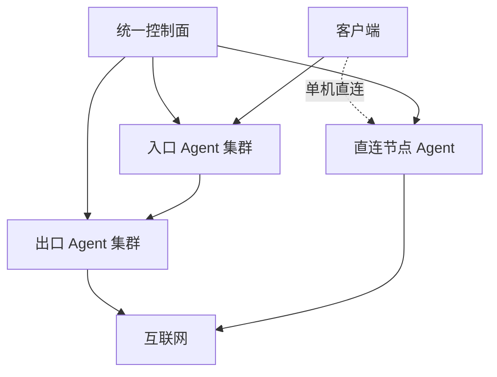

# NexusGate（枢门）

面向多入口机、多出口机和多客户场景的轻量集中编排面板。一个控制面统一管理设备、客户额度、转发线路、单机节点、部署任务和客户端链接，不再逐台打开不同面板维护。

> 当前版本：`v0.5.3`。请先在测试设备验证实际连接、客户端兼容性、云安全组和系统防火墙，再迁移业务。

**从 v0.5.2 续额恢复：** 面板机运行 `ng update`。以后额度用尽而自动暂停时，调高上限或流量清零会自动排队恢复原资源，入口和出口都确认后订阅才重新返回节点；已导入客户端无需更换链接。升级前已经显示“运行中”但线路是“草稿”的历史状态无法可靠区分手动停用，在“转发与节点”点击该线路的“恢复原节点”一次；若原端口已被占用，会提示改用“全新部署”。本次是控制面更新，入口 Agent 已为 v0.5.2 时无需重装。Reality 私钥仍需保存在原 Agent 上；如果机器已重装并丢失密钥，恢复后的节点公钥会变化，应刷新订阅。

## 核心模型

NexusGate 把管理面与流量面分开。客户流量不会经过控制面，控制面只负责把期望配置下发给各设备 Agent。



- **转发线路**：一台或多台入口设备 → 一台出口设备；客户端协议与入口到出口传输协议可以不同。
- **单机直连**：无需出口设备，直接在选定设备创建客户端节点。
- **Agent 主动连接**：控制面不保存各设备的 SSH 密码。
- **一条线路统一维护**：编辑、修复、停用、重建不再分别操作每台服务器。

## 当前已实现

- 默认明亮、可切换暗色的中文响应式 UI；登录页仅保留账号与密码，不显示业务介绍。
- 固定宽度侧栏与可阅读的横排导航：“概览、服务器、客户与订阅、转发与节点、部署与链接、设置与运维”。
- 设备、客户、线路均可创建后编辑；运行中线路修改后进入“待重新部署”。列表操作按行收纳，长列表不再因按钮换行变高。
- 线路表单中的入口设备和客户可搜索后多选，长列表在固定高度内滚动。
- 支持完整重建失败线路，以及只重试失败部署项。
- Agent 重装后自动撤销旧密钥、重新对账并恢复已有资源；首次心跳成功才提示安装完成。Xray 配置错误不会再让 Agent 控制通道退出；引擎状态和错误会显示在设备行。
- 部署前检查目标 Agent 最近心跳与 Xray 状态，离线设备不会造成无限期的“排队中”。面板机可以兼任出口/单机节点，`ng update` 会同步升级本机已安装的 Agent。
- 任务 5 分钟租约、超时自动重试，连续 3 次失败才标记异常。
- 客户到期使用日期选择器、常用期限下拉和时间下拉，不要求手写日期格式。
- 客户独立凭据、流量额度、到期、滚动 IP 上限、用量清零及启停。
- 流量、到期或节点 IP 上限触发暂停后，会移除入口和出口资源以阻断已导入的节点。调整额度、续期或提高 IP 上限后，控制面自动按原端口和原凭据恢复；清理已开始时先等待清理完成，再下发恢复任务。客户手动停用后需要手动启用。旧版已被移除而变为草稿的线路，可在“转发与节点”点“恢复原节点”一次性找回原部署；若原端口已被别的线路占用，须全新部署并更新客户端。
- 流量额度为入口节点上行＋下行之和，转发出口不重复计费。Agent 解析 Xray 的 JSON 双向统计，按累计计数上报；控制面记录各部署上次计数，重复请求不重复计费，Xray 重启后按新进程计数。Agent 升级后若配置相同且 Xray 正常运行，不再重启 Xray 丢失内存计数。客户表显示上行、下行及最后计量时间，设备表显示统计上报状态和错误。订阅头使用独立的 `upload` / `download` 字段。
- 客户列表显示滚动节点 IP 数与最近 24 小时的订阅客户端估计数；“访问”可查看节点 IP 首末上报时间和最近 100 条订阅请求（结果、来源 IP、User-Agent、格式、返回大小）。日志最多保留 30 天 / 全局 10000 条，可为单个客户清空订阅访问窗口。
- 订阅客户端估计上限会在订阅下载时按 `X-Device-ID` / `X-Client-ID` 或 User-Agent 限制新客户端。节点 IP 超限则由入口 Agent 访问日志上报后停用客户，出口收到的入口机 IP 不计为客户 IP。Agent 现在只有在观察记录成功送达控制面后才推进日志游标，临时网络失败可重试。
- Reality 私钥只在节点机生成；控制面只接收客户端公钥。升级时旧部署错误中的误报私钥会从历史记录中脱敏。
- Tesla、Amazon、Apple、Intel、AMD Reality 目标预设，也可自定义。
- IPv4、IPv6 和双栈监听；IPv6 客户端链接会自动使用方括号格式。
- JSON 在线备份/恢复，以及包含数据、环境和 Caddy 配置的迁移压缩包。
- 后台修改登录账号和密码；修改后强制重新登录。
- `ng` 运维菜单：升级、域名、证书、备份、恢复、管理员账号/密码、状态、日志、重启和卸载。
- 失败/未完成线路可从“线路”删除；尚未确认清理的节点资源保留隐藏记录与任务，设备重新上线后继续清理，避免遗留监听端口。
- 若离线设备永久损坏，可在删除关联线路后使用“强制遗忘”；这会放弃远程清理，因此仅限设备已销毁或已手工清除代理配置时使用。
- 线路删除后客户可立即删除；后台仍保留设备资源清理任务。设备登记需要等 Agent 清理确认，或在目标机卸载后对离线设备选择遗忘。
- 每客户独立随机订阅地址，支持 V2Ray、Shadowrocket、通用 Base64、Mihomo/Clash 简洁版和智能分流版、sing-box JSON、Surge 兼容节点及原始 URI；二维码在浏览器本地生成。可重置地址，只分发已成功部署的节点，停用/到期/流量用尽时拒绝分发。
- 入口/出口 Agent 可以在目标机通过 `ng-agent uninstall` 卸载专属服务、配置和密钥；控制台删除登记会撤销其访问资格。
- Agent 支持 Debian/Ubuntu、RHEL 系 systemd，以及 Alpine OpenRC。

## 协议矩阵

| 用途 | 协议 | 状态 |
| --- | --- | --- |
| 客户入口 / 单机节点 | VLESS + Reality + Vision | 可部署 |
| 客户入口 / 单机节点 | VLESS + Reality | 可部署 |
| 客户入口 / 单机节点 | VLESS + WebSocket（无 TLS） | 可部署，建议仅配合可信网络或外层 TLS |
| 客户入口 / 单机节点 | VLESS + WebSocket + TLS | 可部署；入口设备需填写 TLS 域名并安装有效证书 |
| 客户入口 / 单机节点 | Hysteria 2 | 可部署（测试阶段）；入口证书、UDP 入站端口和新版 Xray 必需 |
| 客户入口 / 单机节点 | VMess + WebSocket（无 TLS） | 可部署，兼容模式 |
| 客户入口 / 单机节点 | Shadowsocks 2022 AES-128 / AES-256 | 可部署 |
| 客户入口 / 单机节点 | Shadowsocks AES-128-GCM / AES-256-GCM | 可部署 |
| 客户入口 / 单机节点 | SOCKS5 用户密码 | 可部署，仅建议可信网络或外层隧道 |
| 入口 → 出口 | 上述四种 Shadowsocks | 可部署 |
| 入口 → 出口 | VLESS TCP | 可部署，建议可信网络或外层隧道 |
| 入口 → 出口 | SOCKS5 用户密码 | 可部署，仅建议可信网络或外层隧道 |
| 客户入口 | AnyTLS | 尚未开放；需要独立 sing-box 引擎和与现有额度/IP 管理兼容的统计链路 |

新版 Xray 已提供 Hysteria 2 入站，NexusGate 复用当前 Xray Agent 的任务、统计及出口路由。VLESS WS TLS 与 Hysteria 2 均需入口证书；Hysteria 2 使用所选端口的 **UDP**。AnyTLS 是不同的协议，仍需要 sing-box 和独立的统计与清理适配，尚不能把它当作 VLESS 选项使用。

### Cloudflare 域名和节点证书

1. 在 CF 添加指向**入口设备公网 IP** 的节点子域名 A/AAAA 记录，例如 `node.example.com`。Reality、Hysteria 2 和大多数自定义 TCP/UDP 端口需要设置为 **DNS only（灰云）**；橙云的普通 HTTP 代理不会透传这些协议。证书的 DNS 验证与节点代理状态是不同设置。
2. 在“服务器 → 编辑”填写同一个“节点 TLS 域名”。只用作出口的面板机器不需要节点证书；面板机作为 TLS 入口时，Caddy 已占用 80/TCP，推荐 DNS 验证。
3. 在入口设备 SSH 创建 CF API Token，权限只授予相应 Zone 的 `Zone:DNS:Edit`；在节点机以 root 创建 `/root/cloudflare.ini`，内容为 `dns_cloudflare_api_token = <令牌>`，执行 `chmod 600 /root/cloudflare.ini`。不要把令牌发到聊天或粘贴进控制台。
4. 在同一入口设备运行：

   ```bash
   ng-agent cert issue-cloudflare node.example.com admin@example.com /root/cloudflare.ini
   ng-agent cert status node.example.com
   ```

   Agent 会安装 Certbot Cloudflare 插件、使用 DNS-01 申请受信任证书、配置每日续签检查，并在证书更新时重启 Xray。DNS-01 不需要占用 80/TCP，也不要求节点域名当前解析到该设备。凭据文件应持续保留供续签使用。若该发行版没有相应插件，请按 Certbot 官方说明安装插件或使用 `import`。

5. 如果 80/TCP 空闲且节点域名 DNS only 并已指向当前设备，也可运行 `ng-agent cert issue node.example.com admin@example.com` 使用 HTTP-01。已有合法证书则运行 `ng-agent cert import 域名 /path/fullchain.pem /path/privkey.pem`；手动导入的证书需要自行管理续签。

先运行 `ng-agent-update` 升级旧 Agent，再申请证书。完成后在“转发与节点”点击“修复失败项”；不必删除客户、重新注册节点或改变面板的 HTTPS 域名。

Reality 默认目标/SNI 为 `www.tesla.com:443`，也可选 Amazon、Apple、Intel、AMD 或自定义。目标必须实际接受所选 SNI，预设本身不是防共享或防盗用手段；访问控制依赖每客户随机 UUID、shortId 等凭据。

> “订阅客户端估计上限”只限制新的订阅下载：同一 User-Agent 可能是多台设备，同一设备也可能换 User-Agent，`X-Device-ID` 可以被客户端自行更改。无法凭共享节点链接可靠限制物理设备，必须另做每设备凭据签发与撤销。节点 IP 统计来自 Xray 访问日志，约每分钟上报一次、滚动 10 分钟；部分 UDP-only 流量可能不出现在访问日志，故不能保证精确实时 IP 上限。超限后目前是停用整个客户并排队移除其部署。订阅令牌重置只阻止再下载；已导入的节点凭据须停用或重建线路后才能撤销。

Hysteria 2 依赖 TLS，VLESS WS TLS 也依赖 TLS。可以不用公网 CA 而改用自签证书，但服务端仍须有证书，客户端须导入或固定证书指纹；NexusGate 当前只自动配置受信任证书路径，不会生成自签节点订阅。无需节点证书时可使用已支持的 VLESS Reality。AnyTLS 是独立协议，不是 VLESS 的扩展；需要单独的 sing-box 运行时、统计与清理适配，目前不可部署。

“AnyTLS + VLESS”可以理解为两段链路：客户端以 AnyTLS 接入入口机，再由入口机以 VLESS 连接出口机。实现时需要给入口 Agent 增加 sing-box 服务、AnyTLS 入站与 VLESS 出站配置、节点证书、单独的流量统计及 IP 观察、失败回滚与卸载清理，并提供 AnyTLS 客户端订阅格式。sing-box 的 V2Ray API 统计需要含相应构建功能的二进制。仅把 AnyTLS 写进协议下拉或生成链接不能保证能连接、计费和停用，因此本版继续隐藏部署选项。AnyTLS 密码或节点 URI 一旦被复制仍可被他人使用，协议本身不会阻止盗用；需要每设备单独凭据和服务端撤销能力。

**引擎取舍：** sing-box 官方配置同时覆盖 VLESS（含 Vision/Reality）、WebSocket、Hysteria 2、Shadowsocks 2022 和 AnyTLS，因此协议能力允许以后统一使用 sing-box。但直接替换正在运行的 Xray 会涉及所有现存资源的端口、Reality 密钥、公钥、客户端配置、流量基线与订阅格式迁移。本项目先以独立 sing-box 入口服务实现 AnyTLS，保留现有 Xray 线路；入口 sing-box 通过 VLESS 或 SS2022 连到现有出口。放行到 UI 前必须验证自定义构建含 V2Ray API、每客户双向计数、访问 IP 观察、证书续签、部署回滚、重启恢复和暂停/续额流程。迁移其它协议应逐个灰度切换，不能仅改二进制名称。当前 v0.5.3 未安装 sing-box，也未开放 AnyTLS 部署。

如果 Clash Verge 显示“系统代理已关闭”，普通浏览器测速和播放视频可能走本机直连，节点统计仍为 0 B。测试时开启系统代理或 TUN，手动选定节点并确认客户端连接日志，再等待 Agent 一次上报（约 60 秒），刷新客户列表与客户端订阅。入口机 `ng-agent doctor` 会显示 Xray 原始入站双向计数和查询错误；若节点有连接而计数仍为空，请先检查当前设备的统计状态和 Xray 配置。Clash 智能分流模板提供 Meta 服务独立策略组，可针对 Facebook、Instagram 和 WhatsApp 选择同一出口的不同节点对比；分流规则本身不能保证速度提升。

额度停用在下一次上报与后台巡检后执行，测速或短时大流量可能暂时超过额度；Xray 异常重启、节点下线或删除前尚未上报的内存计数也可能丢失。本版统计适合运营额度，不是实时硬限速或精确计费账本。若客户此前始终显示 0 B，旧流量不会在升级后自动补算；从新版 Agent 首次成功上报开始核对。

## 安装控制面

准备一台 Debian 12 或 Ubuntu 22.04/24.04 VPS，把面板域名的 A/AAAA 记录解析到它，并放行 TCP 80、443：

```bash
bash <(curl -fsSL https://raw.githubusercontent.com/a2899882/NexusGate/main/scripts/install.sh)
```

非交互安装：

```bash
bash <(curl -fsSL https://raw.githubusercontent.com/a2899882/NexusGate/main/scripts/install.sh) \
  --domain gate.example.com --email admin@example.com
```

安装器会部署 Node.js、Caddy、systemd 服务，启用自动 HTTPS，并输出首次登录密码。

登录后的顺序：

1. 在“服务器”添加入口、出口或综合节点。
2. 点击“注册 / 重装”，复制一次性命令到目标 VPS 以 root 执行。
3. 在“客户与订阅”创建客户。
4. 在“转发与节点”选择转发线路或单机直连，选择协议、设备、客户和端口策略。
5. 点击部署，在“部署与链接”复制单条客户端链接，或在“客户与订阅 → 订阅链接”获取各客户端订阅和二维码。

订阅 URL 属于凭据；请经 HTTPS 私下交付。自动识别格式根据客户端 User-Agent 返回 Clash/Mihomo 或 Base64；识别不准时使用固定格式。智能分流包含广告拦截、国内直连、AI/流媒体分组和自动延迟选择；客户端需要可用的 Mihomo geodata。Surge 格式只导出它支持的 SS、SOCKS5 和 VMess 节点；若无兼容节点则返回错误。sing-box JSON 是本机 127.0.0.1:2080 混合入站配置，可能与已有监听端口冲突。自定义订阅模板和可靠的一设备一凭据仍待开发。

> 云安全组和系统防火墙必须放行实际使用的 TCP/UDP 端口。默认端口池为 `20000–50000`，生产环境建议按设备缩小范围。

### Alpine Agent

Alpine 首次执行前如果没有 Bash：

```sh
apk add --no-cache bash curl
```

然后运行面板生成的同一条注册命令。安装器会自动使用 OpenRC。

## 升级

控制面一键升级会先自动备份，再下载 GitHub `main` 分支并执行健康检查：

```bash
ng update
```

旧版 Agent 可保留当前注册密钥原地升级：

```bash
curl -fsSL https://raw.githubusercontent.com/a2899882/NexusGate/main/scripts/agent-update.sh | bash
```

新安装的 Agent 以后直接运行：

```bash
ng-agent-update
ng-agent uninstall         # 新版 Agent 在目标机交互卸载
ng-agent doctor            # 检查心跳、Xray 配置、服务及最近错误
ng-agent cert issue node.example.com admin@example.com
ng-agent cert issue-cloudflare node.example.com admin@example.com /root/cloudflare.ini
ng-agent cert import node.example.com /path/fullchain.pem /path/privkey.pem
ng-agent cert status node.example.com
```

如果某台设备已出现“上线后又离线”，先在该机运行 `ng-agent doctor`，核对控制面连通性、Xray 配置错误和服务日志。然后更新 Agent；必要时在控制面重新生成“注册 / 重装”命令并执行。注册后首次心跳失败会明确报错。

老 Agent 没有 `ng-agent` 命令时，先运行 `ng-agent-update`，或在目标机运行：

```bash
curl -fsSL https://raw.githubusercontent.com/a2899882/NexusGate/main/scripts/agent-uninstall.sh | bash
```

卸载仅删除 NexusGate 专属的 Agent/Xray 服务、`/etc/nexusgate` 配置与密钥、Agent 程序和日志。共用的 Node.js 和 `/usr/local/bin/xray` 不会被自动删除。卸载后回控制台删除设备；如果之前的清理任务尚未确认且设备已离线，用“遗忘离线设备”撤销登记。控制台遗忘不能远程删除旧机器资源。

## `ng` 管理菜单

```bash
ng                         # 交互菜单
ng update                  # 备份、升级、健康检查
ng domain new.example.com  # 更换面板域名
ng cert                    # 校验 Caddy 并检查证书日志
ng backup                  # 生成 /root/nexusgate-backup-*.tar.gz
ng restore /root/文件.tar.gz
ng account                 # 交互修改当前管理员账号和/或密码
ng account oldname         # 指定旧账号；ng password 为兼容别名
ng status
ng restart
ng logs 200
ng uninstall               # 确认后先备份再卸载
```

Caddy 会自动申请和续签证书，不需要定时手工续签；`ng cert` 用于校验配置、重新加载并查看最近证书日志。

## 容灾迁移

NexusGate v0.2 是单控制面、冷备恢复模型，不支持两台控制面同时写同一个 JSON 数据库。

1. 提前降低面板域名 DNS TTL。
2. 在旧控制面执行 `ng backup`，下载 `/root/nexusgate-backup-*.tar.gz`。
3. 在新 Debian/Ubuntu 服务器安装 NexusGate，使用原面板域名。
4. 把压缩包上传到新服务器 `/root`，执行 `ng restore /root/文件名.tar.gz`。
5. 把 Cloudflare/DNS 的 A/AAAA 记录改为新服务器 IP，并确保 80/443 放行。
6. Caddy 获取证书后，各 Agent 仍连接同一域名，会自动恢复上报；无需逐台更改控制面地址。

迁移包包含：控制面数据库、登录/运行环境配置和 Caddy 站点配置。恢复前系统还会在 `/root` 自动再生成一份安全快照。

## 配置建议

控制面不承载客户流量，主要消耗来自 Agent 心跳、任务和统计写入。

| 规模 | 建议控制面配置 | 说明 |
| --- | --- | --- |
| 测试 / 20 台以内 | 1 vCPU / 1 GB / 20 GB SSD | 可运行，不建议承担关键业务 |
| 20–100 台、数百客户 | 2 vCPU / 2–4 GB / 40 GB NVMe | 推荐生产起点 |
| 100–300 台、约千名客户 | 4 vCPU / 8 GB / 80 GB NVMe | 需要监控磁盘延迟并缩短日志保留 |
| 更大规模或多管理员高频操作 | PostgreSQL/队列版 | 当前 JSON 单机版不建议继续横向放大 |

Agent 节点推荐至少 `1 vCPU / 512 MB`，更稳妥为 `1 vCPU / 1 GB`。节点能承载多少用户主要取决于带宽、连接数、加密协议和线路质量，而不是控制面配置。

## 轻量与安全设计

- 控制面和 Agent 均无 npm 运行依赖，只要求 Node.js 18+。
- Agent API Key 使用指纹快速定位，再用 scrypt 校验，避免大量心跳反复全表执行慢哈希。
- 数据文件、备份和 Agent 环境文件默认权限为 `0600`。
- 登录 Cookie 为 HttpOnly、SameSite=Strict，HTTPS 下启用 Secure；写操作需要 CSRF Token。
- Xray 配置先执行 `run -test`，通过后才原子切换；失败会回滚资源文件。
- Agent 重启会从持久化资源目录重建完整 Xray 配置。
- 仅在你有权管理的服务器和网络上使用，并遵守所在地法律和服务商政策。

更完整的说明见 [架构](docs/ARCHITECTURE.md)、[安全模型](docs/SECURITY.md) 和 [路线图](docs/ROADMAP.md)。

## 本地开发

```bash
export NG_ADMIN_PASSWORD='change-this-password'
export NG_COOKIE_SECURE=false
npm test
npm start
```

打开 <http://127.0.0.1:8787>，默认账号为 `admin`。

## 许可

[MIT](LICENSE)。NexusGate 不打包或重新许可 Xray-core；Agent 安装器从 Xray 官方 Release 下载独立二进制。
